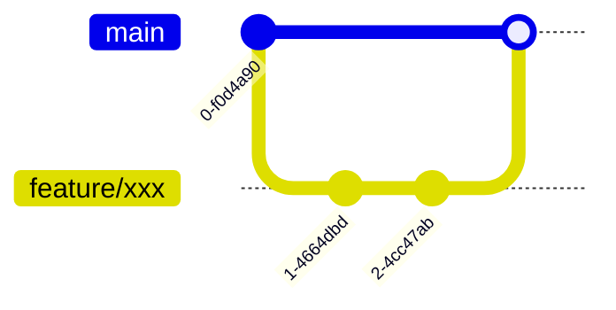

# Seer2 Pet Animator


用于约瑟传说的精灵动画播放组件。
关于该组件的实际演示: [预览网页](https://seer2-pet-render.netlify.app)

## 快速开始

### 环境要求
- Node.js 18+
- npm 9+

### 安装依赖
```bash
npm install
```

### 开发模式
```bash
npm run dev
```

### 生产构建
```bash
npm run build
```

## 贡献指南

### 代码规范
- TypeScript遵循strict模式
- ActionScript需通过@as2ts/core编译
- 提交前必须通过ESLint检查

### Git流程


## 核心模块说明
- `pet-render.ts`: 动画渲染核心控制器
- `actionState.ts`: 动作状态机实现
- `Fight.as`: 战斗动作脚本模板

## 维护者
[@yuuinih](https://github.com/yuuinih)
